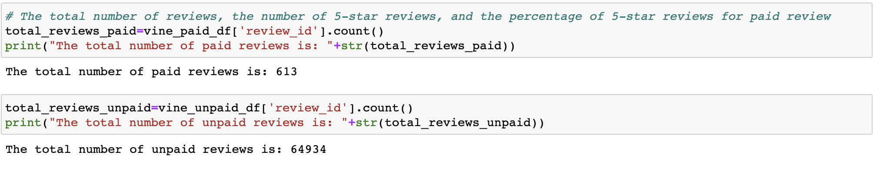
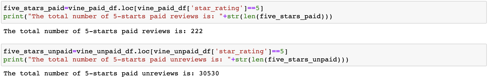
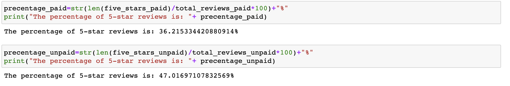

# Amazon_Vine_Analysis

## Overview of the analysis

### Purpose

The purpose of this project is performing the ETL process in order to analyze Amazon reviews of wireless products and to determine if there is any bias toward favorable reviews from Amazon Vine members using PySpark, AWS RDS instance, Pandas and SQL.

## Results

- How many Vine reviews and non-Vine reviews were there?
  
  
  
  There are 613 Vine reviews and 64934 non-Vine reviews.

- How many Vine reviews were 5 stars? How many non-Vine reviews were 5 stars?
  
  
  
  222 Vine reviews are 5 stars.
  
  30530 non-Vine reviews are 5 stars.

- What percentage of Vine reviews were 5 stars? What percentage of non-Vine reviews were 5 stars?

  
  
  The percentage of 5 starts Vine reviews is 36.2%.
  
  The percentage of 5 starts non-Vine reviews is 47.0%

## Summary

Since the percentage of 5 stars non-Vine reviews is greater than Vine reviews (47.0% > 36.2%), therefore, there does not have any positivity bias for reviews in the Vine program.

Additionally, we could analyze the statistical distribution of star ratings for Vine and non-Vine reviews, such as mean, median, standard deviation.
